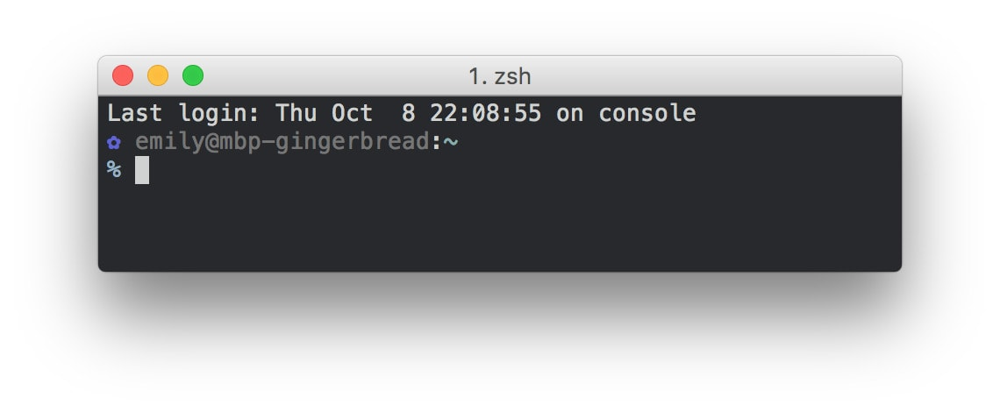

# dotfiles

Hello, and welcome to how I do the computer thing



## Quick setup:

```
PLAYBOOK_PATH=$(mktemp -d)/playbook.yml curl https://raw.githubusercontent.com/emilyhorsman/dotfiles/master/playbook.yml -o $PLAYBOOK_PATH && ansible-playbook $PLAYBOOK_PATH -i 'localhost,' -c local
```

## Ansible

Setup is done with an Ansible playbook. This playbook downloads the `dotfiles`
git repo and various dependencies. It then symlinks dotfiles into the correct
places.

Install Ansible [via pip](http://docs.ansible.com/ansible/intro_installation.html#latest-releases-via-pip)

```
$ sudo pip install ansible
```
